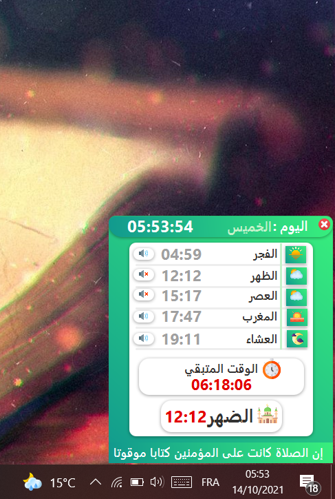

<h1 align="center"> PrayerTimes </h1>

Desktop application 💻 for calculating Muslim prayer times 🕌 and alarm (Adhan) ⏰🔊 for the prayer times 🕒  

يمكنك هذا التطبيق 💻 من :
  
- معرفة أوقات الصلاة في ولايات تونس 
- معرفة الوقت المتبقى للصلاة القادمة
- امكانية اختيار التنبيه عن الطريق الأذان او الوضع الصامت

## Screenshots
Main App           | Adhan
:---------------------:|:------------------:
  | 

(<a href="#top">back to top</a>)

## Features
* [x] تحديد معدل ضهور الدعاء  
* [x] اضافة الوضع اليلي
* [x] اضافة الوان مختلفة للاشعارات
* [x] صفحة التسبيح
* [ ] الاعدادات

(<a href="#top">back to top</a>)

## Ressources & Libraries 📚

| Library | icon |
| ------ | ------ |
| JFoenix | [flaticon.com](flaticon.com) |
| JavaFx | [icones8.fr](icones8.fr) |
| AnimateFX | [freepik.com](freepik.com) |
| controlsfx | 
| fontawesomefx | 
| jfoenix | 
| json | 

(<a href="#top">back to top</a>)

